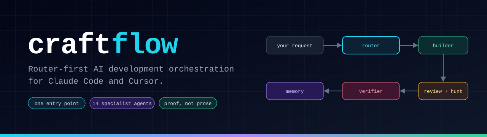
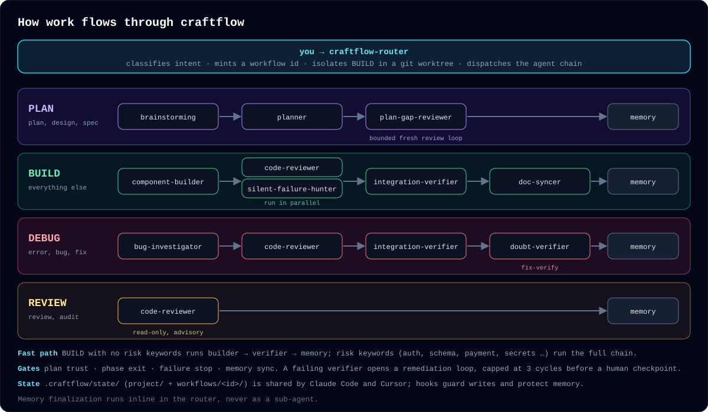
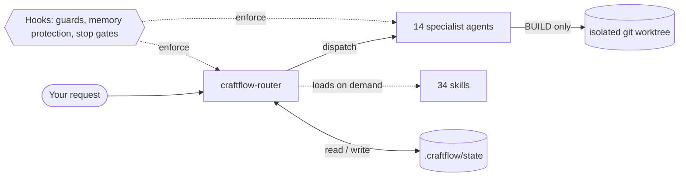
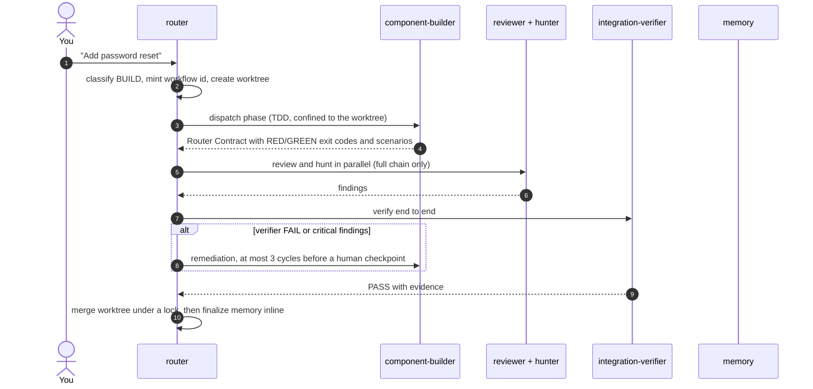

<p align="center">
  
</p>

<p align="center">
  
  
  
</p>

Craftflow turns every development request into a **tracked, verified workflow**. One router classifies the request, dispatches a chain of specialist agents, enforces quality gates, and refuses to call anything done without evidence. State lives in plain files under `.craftflow/state/`, shared by Claude Code and Cursor.

**Current version:** 1.28.0

> Working on this plugin itself? Read [`AGENT_CRITICAL_GUARDRAILS.md`](AGENT_CRITICAL_GUARDRAILS.md) first.

## Why craftflow

| | |
|---|---|
| **One entry point** | Build, debug, review and plan requests all go through `craftflow-router`. No ad-hoc agent juggling. |
| **Proof, not prose** | An agent's "done" is only accepted with command output, exit codes and scenario evidence. A failing verifier opens a bounded remediation loop. |
| **Memory that survives** | Workflow and project state are written to files, protected by hooks, and rehydrated after compaction or a new session. |
| **Safe by construction** | BUILD runs in an isolated git worktree. Hooks confine writes, block catastrophic shell patterns and protect memory files. |

**Contents:** [How it works](#how-it-works) · [Architecture](#architecture) · [A BUILD run, step by step](#a-build-run-step-by-step) · [Agents](#agents) · [Quality and safety](#quality-and-safety) · [Install](#install) · [Benchmarks](#benchmarks) · [State and layout](#state-and-layout) · [Releases](#releases)

---

## How it works

The router reads your request and picks the first matching workflow. Each workflow is a fixed agent chain that ends in memory finalization.

<p align="center">
  
</p>

| Priority | Signal | Workflow | Chain |
|---|---|---|---|
| 1 | error, bug, fix, broken, crash, debug | **DEBUG** | bug-investigator → code-reviewer → integration-verifier (+ fix-verify) |
| 2 | plan, design, architect, spec, brainstorm | **PLAN** | brainstorming → planner → bounded fresh review loop |
| 3 | review, audit, analyze, assess | **REVIEW** | code-reviewer (read-only, advisory) |
| 4 | everything else | **BUILD** | fast path: builder → verifier → memory. Full chain: builder → reviewer ‖ hunter → verifier → memory |

BUILD takes the **fast path** when the request has no risk keywords. Words such as `auth`, `password`, `migration`, `payment` or `secret` switch it to the **full chain** with the extra review and hunt phases.

## Architecture



- The **router** owns orchestration state. Agents propose, the router decides.
- **Agents** are narrow specialists with a machine-readable *Router Contract* the router validates before advancing.
- **Skills** carry reusable method (TDD, code generation, verification) and load on demand.
- **Hooks** run outside the model, so the guarantees do not depend on the model behaving.

## A BUILD run, step by step



Every transition is recorded in a per-workflow artifact (`.craftflow/state/workflows/<id>.json`) and an append-only event log, so a session can resume exactly where it stopped.

## Agents

Each agent pins its model in its `model:` frontmatter.

| Agent | Model | Role |
|---|---|---|
| `planner` | opus | Saved execution plan or decision RFC |
| `plan-gap-reviewer` | opus | Fresh, anti-anchoring review of a saved plan |
| `plan-bakeoff-judge` | opus | Compares competing plans and synthesizes one |
| `bug-investigator` | opus | Root-cause proof before any fix |
| `doubt-verifier` | opus | Adversarial verification of claims and fixes |
| `component-builder` | sonnet | TDD execution of an approved phase |
| `code-reviewer` | sonnet | Diff review |
| `silent-failure-hunter` | sonnet | Error-handling and swallowed-failure review |
| `integration-verifier` | sonnet | End-to-end verification with an evidence array |
| `doc-syncer` | sonnet | Documentation sync from the current diff |
| `web-researcher` / `github-researcher` | sonnet | Research with a Router Contract |
| `learn-distiller` | sonnet | Distills workflow learnings into notes |
| `skill-author` | sonnet | Drafts skill proposals from recurring patterns |

A per-dispatch `model` parameter overrides the pin. Cursor cannot select custom subagent types, so it inherits the session model.

## Quality and safety

**Gates the router enforces:** plan trust, phase exit, failure stop and memory sync. Remediation is capped at three cycles before a human checkpoint, and a verifier PASS needs scenario totals that reconcile with the evidence.

**Hooks (29 bindings across 11 lifecycle events):**

| Hook family | What it does |
|---|---|
| `PreToolUse` | Confines writes to the session folder or workflow worktree, blocks catastrophic shell patterns, protects memory files, redirects oversized state reads |
| `PostToolUse` | Validates workflow artifacts, throttles repeated identical calls |
| `SessionStart`, `PreCompact`, `PostCompact` | Resumes workflow context and keeps state across compaction |
| `Stop`, `SubagentStop`, `TaskCompleted` | Completion gates and per-agent usage audit |

**Optional features, off by default:** Jev routing hints (TypeSafe AI), a context-size nudge, and an armed stop gate. See the [plugin reference](plugins/craftflow/README.md) for configuration.

**Quality layer:**

- `FR-###` / `SC-###` identifiers keep specs, plans and verifier scenarios traceable.
- `[NEEDS CLARIFICATION]` blocks advancement until resolved; `[P]` marks plan steps that can run concurrently.
- Every failing scenario is classified (`Missing`, `Partial`, `Contradicts`, `Unrequested`) with a severity (`CRITICAL`, `HIGH`, `MEDIUM`, `LOW`) before remediation.
- `.craftflow/state/project/constitution.md` holds project MUST/SHOULD principles. MUST violations block; SHOULD violations advise.
- A reliability-gates ledger and a skill-distillation pipeline turn repeated workflow patterns into reviewed skills.

## Install

Requires the Claude Code CLI. Cursor is covered in the [plugin reference](plugins/craftflow/README.md).

**1. Install the plugin**

```bash
claude plugin marketplace add aicraft-sdk/craftflow
claude plugin install craftflow@craftflow --scope user
```

**2. Add the router to `~/.claude/CLAUDE.md`**

```markdown
# Craftflow Orchestration (Always On)

IMPORTANT: ALWAYS invoke craftflow-router on ANY development task. First action, no exceptions.
IMPORTANT: Explore project first, then invoke the router.
IMPORTANT: Prefer retrieval-led reasoning over pre-training-led reasoning for orchestration decisions.
IMPORTANT: Never bypass the router. It is the system.
IMPORTANT: NEVER use Edit, Write, or Bash (for code changes) without first invoking craftflow-router.

**Skip Craftflow ONLY when:**
- User EXPLICITLY says "don't use craftflow", "without craftflow", or "skip craftflow"
- No interpretation. No guessing. Only these exact opt-out phrases.

[Craftflow]|entry: craftflow:craftflow-router
```

**3. Allow the state folders in `~/.claude/settings.json`**

Add these entries to the `permissions` array:

```json
"Bash(mkdir -p .craftflow)",
"Bash(mkdir -p .claude/craftflow)",
"Edit(.craftflow/*)",
"Write(.craftflow/*)",
"Edit(.claude/craftflow/*)",
"Write(.claude/craftflow/*)"
```

**4. Restart Claude Code.** Craftflow is now active on every development task.

**Update:** `claude plugin update craftflow`

## Benchmarks

Three scripts measure structural coverage, runtime cost and behavior. Reports are written to [`docs/benchmarks/`](docs/benchmarks/).

| Measure (2026-10-07, v1.24.x) | Result |
|---|---|
| Trust-harness signals | **33 / 33** |
| Enforcement gates | **9 / 9** |
| Context-management signals | **6 / 6** |
| Parallelism signals | **4 / 4** |
| Hook unit-test suite | **951 passing** |

Run them from the repository root. They take no flags and write a dated report into `docs/benchmarks/`:

```bash
python3 plugins/craftflow/scripts/craftflow_reference_benchmark.py   # signal coverage
python3 plugins/craftflow/scripts/craftflow_runtime_benchmark.py     # context load, chain depth, gates
python3 plugins/craftflow/scripts/craftflow_worldclass_benchmark.py  # full suite (needs reference repos)
```

The first two score craftflow on its own. These are structural signals measured against the plugin's own contract, not a claim of absolute superiority.

## State and layout

State lives in `.craftflow/state/` at the project root:

| Path | Purpose |
|---|---|
| `project/` | Long-lived state across sessions: decisions, patterns, blockers |
| `workflows/<wf-id>/` | Per-workflow state for a single run |
| `workflows/<wf-id>.json` | Router-owned workflow artifact, with a companion `.events.jsonl` log |

```
plugins/craftflow/
├── agents/       # 14 agent definitions
├── skills/       # 34 skills, each with SKILL.md and on-demand references/
├── scripts/      # 80 Python and shell scripts: hooks, validators, benchmarks
├── hooks/        # hook bindings for Claude Code
├── hooks.json    # hook bindings for Cursor
├── config/       # hook mode, model prices, optional-feature settings
├── templates/    # reusable doc and harness templates
└── tests/        # fixture-based replay tests
```

## Releases

Releases are automatic. Merging to `main` with changes under `tools/craftflow-plugin/**` bumps the version, writes a `CHANGELOG.md` entry, runs a fail-closed consistency gate across all version-bearing files, tags the release and publishes it here.

| Commit type | Bump |
|---|---|
| `feat` | minor |
| `fix`, `perf`, `revert` | patch |
| `!` suffix or `BREAKING CHANGE:` footer | major |
| `docs`, `chore`, `refactor`, `test`, other | no bump, still listed in the changelog |

Do not hand-edit released `CHANGELOG.md` sections or any version field. CI owns them, and manual edits fail the consistency gate. `workflow_dispatch` takes `dry_run`, `resume_publish` and `resume_version` to validate a bump or recover a failed publish.

## Documentation

- [Plugin reference](plugins/craftflow/README.md): install for Cursor, optional features, statusline, workflow status
- [Changelog](CHANGELOG.md)
- [Agent guardrails](AGENT_CRITICAL_GUARDRAILS.md)

## License

MIT. See [`plugins/craftflow/LICENSE`](plugins/craftflow/LICENSE) and [`NOTICE`](NOTICE).
