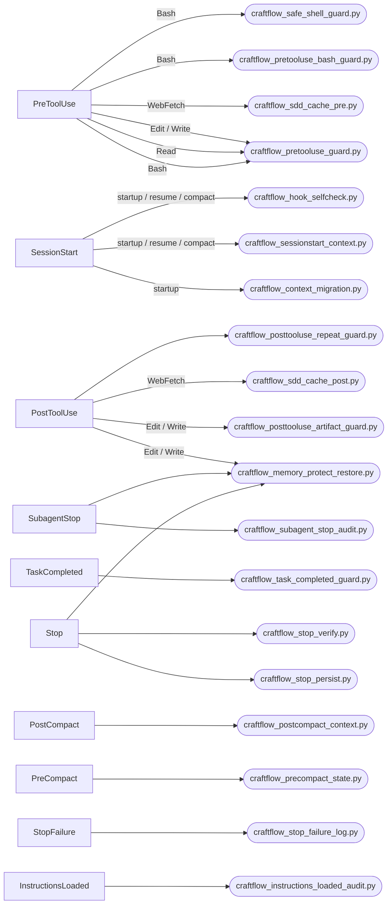
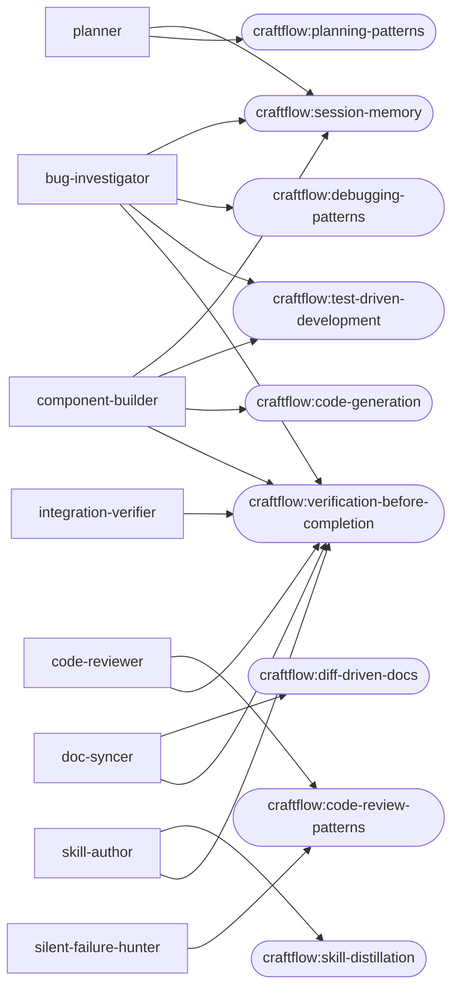

# Craftflow Architecture (generated)

<!-- GENERATED FILE -- do not hand-edit. Run `node scripts/gen-craftflow-graph.mjs`
     from the repo root to regenerate, or `pnpm run gen:craftflow-graph`.
     `pnpm run verify:craftflow-graph` checks this file isn't stale. -->

Introspected from `hooks/hooks.json` and `agents/*.md` / `skills/*/SKILL.md`
frontmatter — not hand-maintained, so it can't silently drift from the actual
registrations the way a hand-written summary table can.

## Hook wiring

Every registered hook event, its matcher (tool-name pattern, or unmatched `*`
for events that aren't tool-scoped), and the script it invokes.

23 hook registrations across 10 event types, 19 distinct scripts.

## Agent -> declared skills

Skills each agent's frontmatter (`skills:`) declares pre-loading. Agents not
shown here declare none in frontmatter (they can still invoke any skill via
the `Skill` tool at runtime — this graph reflects declared, not possible,
wiring): `doubt-verifier`, `github-researcher`, `learn-distiller`, `plan-gap-reviewer`, `web-researcher`.

## Agent -> declared tools

| Agent | Declared tools |
|-------|----------------|
| `bug-investigator` | `Read`, `Edit`, `Write`, `Bash`, `Grep`, `Glob`, `Skill`, `LSP`, `WebFetch`, `TaskUpdate` |
| `code-reviewer` | `Read`, `Bash`, `Grep`, `Glob`, `Skill`, `LSP`, `WebFetch` |
| `component-builder` | `Read`, `Edit`, `Write`, `Bash`, `Grep`, `Glob`, `Skill`, `LSP`, `WebFetch`, `TaskUpdate` |
| `doc-syncer` | `Read`, `Edit`, `Write`, `Bash`, `Grep`, `Glob` |
| `doubt-verifier` | `Read`, `Bash`, `Grep`, `Glob`, `LSP` |
| `github-researcher` | `Read`, `Write`, `Edit`, `Bash`, `WebFetch`, `WebSearch`, `TaskUpdate` |
| `integration-verifier` | `Read`, `Bash`, `Grep`, `Glob`, `Skill`, `LSP`, `WebFetch` |
| `learn-distiller` | `Read`, `Bash`, `Grep`, `Glob` |
| `plan-gap-reviewer` | `Read`, `Grep`, `Glob`, `LSP` |
| `planner` | `Read`, `Edit`, `Write`, `Bash`, `Grep`, `Glob`, `Skill`, `LSP`, `WebFetch`, `TaskUpdate` |
| `silent-failure-hunter` | `Read`, `Bash`, `Grep`, `Glob`, `Skill`, `LSP`, `WebFetch` |
| `skill-author` | `Read`, `Edit`, `Write`, `Bash`, `Grep`, `Glob` |
| `web-researcher` | `Read`, `Write`, `Edit`, `Bash`, `WebFetch`, `WebSearch`, `TaskUpdate` |

## Inventory

- 13 agents (`agents/*.md`)
- 28 skills (`skills/*/SKILL.md`)
- 19 hook scripts wired in `hooks/hooks.json`
